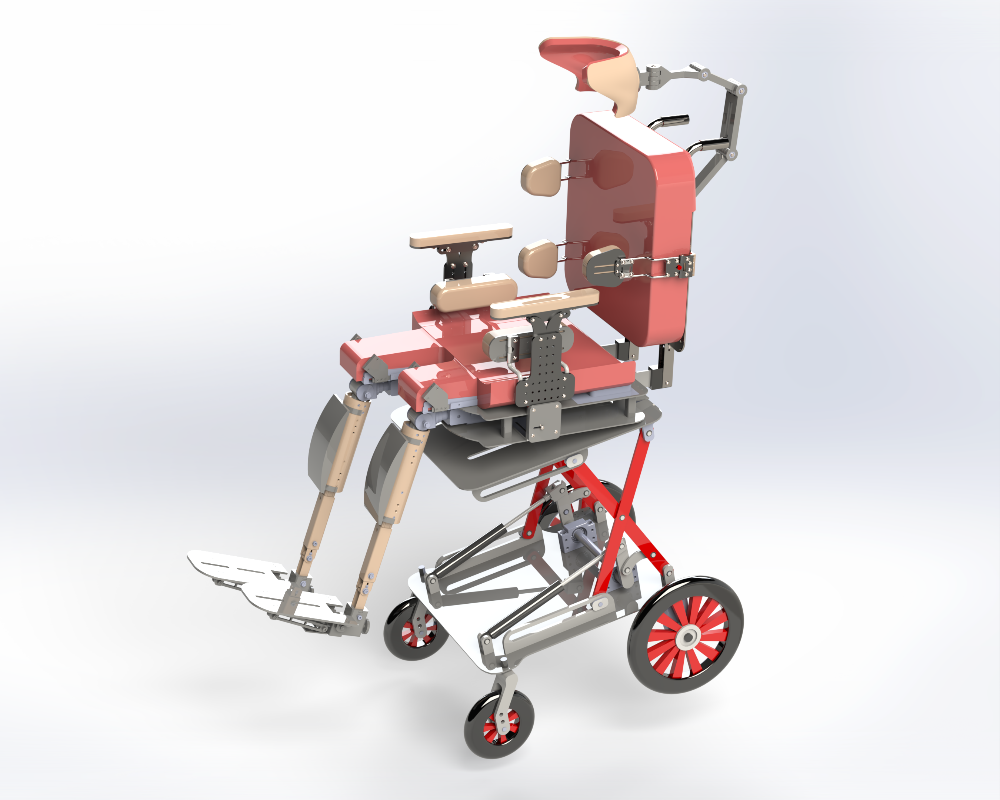

# Cerebral Palsy Chair — Assistive Seating System

This repository contains the design and documentation for a **custom assistive chair** developed to improve comfort, posture, and functional support for individuals with Cerebral Palsy (CP).  
The project focuses on modularity, adjustability, and pressure distribution to reduce fatigue and improve daily usability.

---

## 📂 Contents
- **`Proposal_CerebralPalsyChair.pdf`** — Project proposal document with background, objectives, and initial design concepts.
- **`images/`** — High-quality render of the chair and some sample parts and mechanisms.
- **`SampleDrawings.pdf`** — Sample of Engineering drawings and CAD exports.

---

## 🎯 Project Goals
1. Provide **customizable static and dynamic support** for different body parts.
2. Optimize **pressure distribution** using ergonomic design principles.
3. Allow **multi-degree-of-freedom adjustments** for improved comfort.
4. Ensure the chair is **cost-effective** and easy to manufacture.

---

## 🖼 Design Highlights
- **Headrest** with distributed pressure and multiple static/dynamic degrees of freedom.
- **Seat & Backrest** geometry tuned for support and reduced pressure hotspots.
- **Knee and Leg Support Mechanism** allowing adjustable positioning.
- **Modular Frame** for easy assembly and maintenance.

---
## 📧 Contact
**Mohammadsaeid Safizadeh**  
[LinkedIn](https://www.linkedin.com/in/saeid-safizadeh) · [Email](mailto:ms.safizadeh@gmail.com)
[Website](https://mech.sharif.edu/~ms.safizadeh/)
